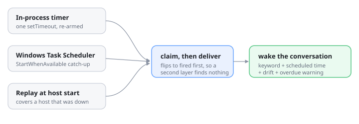

# ⏰ dsh-clock

[English](README.md) | [中文](README.zh.md)

A **calendar and clock for [DeepSeek Harness](https://github.com/deepseek-ai/deepseek-harness)** that can
**wake a conversation**: pick an instant, a keyword, and the conversation to wake — the user or the agent —
and when that instant passes the keyword is delivered into that conversation, *even if it is closed*.

Every wake carries the clock: the scheduled instant, the actual instant, the signed drift, and an explicit
warning when it is late. A wake that arrives three hours overdue must not read like one that arrived on time.



## Why this exists

The harness already schedules reminders, but only inside the conversation that asked for one.
[`@deepseek-ai/dsh-schedule`](https://www.npmjs.com/package/@deepseek-ai/dsh-schedule) says so plainly:
delivery is session-local, there is **no cold-session scheduler**, and a closed session keeps its reminders
overdue until somebody resumes it. So you cannot tell a long-running task "come back to this at 09:00" and
then close the tab.

This plugin fills exactly that gap. An alarm names the conversation it wakes, that conversation may be closed,
and waking it resumes it.

## The wake message

```text
⏰ dsh-clock wake — keyword: 继续迁移

scheduled  2026-09-11T09:30:00+08:00  [Asia/Shanghai]
now        2026-09-11T11:43:12+08:00  [Asia/Shanghai]
drift      +2h13m  OVERDUE
now-epoch  1789098192000
trigger    catch-up replay at host start

warning    OVERDUE by +2h13m: the host was not running at the scheduled instant and this is a catch-up
           delivery. Re-check anything time-sensitive before continuing.
note       This message was delivered by a timer, not typed by the user. Treat "继续迁移" as the signal
           to resume whatever was planned for this instant.
detail     检查构建是否结束
```

The `drift` and `warning` lines are the point. Without them the woken agent cannot tell "it is 09:30 as
planned" from "it is 11:43 and you are three hours late", and it will happily act on a stale premise.

## Install

```bash
npm install
npm run build
dsh plugin --profile web add link:<this-directory>
# or straight from git:
dsh plugin --profile web add <git-url>
```

Then **restart dsh web** so it loads — the [dsh-web-watchdog](https://github.com/catsenior507/dsh-web-watchdog)
panel's restart button is the quick way. A **日历** button then appears in the sidebar foot, directly above
Settings; it opens the panel.

## Use

### From the panel

- The **clock** shows the current time, the zone, and a live countdown to the next wake.
- The **calendar** marks every day that carries an alarm; click a day, type a time and a keyword, choose the
  conversation, and press the button. The button always says exactly what it will create.
- The alarm list is split into **pending** and **settled**, each its own scroll window, so a long history cannot
  stretch the panel. Pending rows sort soonest-first; settled rows sort most-recent-first.
- **Branching is noticed.** Branching a conversation copies the conversation, not the alarm table, so an
  alarm set before the branch would keep pointing at the parent and the branch would never be woken. The
  panel asks once per uncovered branch - copy the alarms onto it, or decline; either answer is remembered.
- Each row can be **edited**, fired immediately, cancelled, or deleted. Editing loads the alarm back into the
  form — instant, keyword, content and target all stay changeable — and the button becomes **保存修改**. Only a
  pending alarm can be edited: changing one that already fired would promise a delivery that is not going to
  happen. A fired row reports whether it was on time or late, and any delivery error is shown on the row.

### From the agent

The model gets a `clock` tool:

```jsonc
{ "action": "set", "afterSeconds": 2700, "keyword": "check the build",
  "note": "the release job should be done by now" }

// wake a different conversation:
{ "action": "set", "at": "2026-09-11T09:30:00+08:00", "keyword": "standup",
  "sessionId": "session-…", "timeZone": "Asia/Shanghai" }

{ "action": "now" }      // what time is it
{ "action": "list" }     // pending and recent alarms
{ "action": "cancel", "id": "a-…" }
```

The plugin also ships a **skill** named `clock`. The tool is advertised by one line; the skill is
how a conversation that has never seen this plugin learns the parts that line cannot carry — that a
target may be a closed conversation, that a closed target is continued rather than forked, and that
a wake delivered late says how late it is. It is registered as a bundled skill, so it appears in
the catalog of every conversation in the profile.

## How the timing works

Three layers, one delivery path:

| Layer | Covers |
|---|---|
| **In-process timer** | The ordinary case. Exactly one `setTimeout` armed for the earliest pending alarm, re-derived on every change. No polling loop, no CPU while idle. |
| **Windows scheduled task** | Machine sleep, a suspended host, and missed schedules — `StartWhenAvailable` lets Windows run the task as soon as the machine is actually available. It is also the only layer that can be told to wake the machine (`wakeComputer`). |
| **Replay at host start** | The host was not running when the alarm was due. This is what actually delivers a missed alarm, and it is why the wake text reports drift. |

All three call the same **claim-then-deliver** path, and an alarm is flipped to `fired` *before* any delivery
starts. Whichever layer arrives first wins and the others find nothing to claim, so stacking three triggers
cannot deliver one wake three times. The prompt also carries a request id derived from the alarm id, which the
session controller deduplicates as a second line of defence.

The OS task is a *mirror*, not the owner: it only pings the plugin's own endpoint. A missing, failed, or stale
task degrades to the other two layers instead of losing the wake. It is registered with PowerShell's
`ScheduledTasks` module (not `schtasks.exe`, which cannot express `StartWhenAvailable`) and removed when the
plugin is disposed.

## Configuration

```yaml
- id: ui-clock
  name: '@dsh-external/dsh-client-plugin-clock'
  config:
    port: 4801                  # private carrier port when the profile has no web server
    dataDir: …                  # default: $DSH_HOME/clock
    defaultTimeZone: Asia/Shanghai
    useSystemScheduler: true    # mirror the earliest alarm into Windows Task Scheduler
    wakeComputer: false         # let that task wake the machine from sleep
    wakeMode: queue             # queue | steer — how the wake enters a busy conversation
    driftToleranceSeconds: 60   # lateness below this still reads ON-TIME
    retainFiredDays: 7          # how long a settled alarm stays in the panel
    exposeTool: true            # register the clock tool for the agent
```

## Limits, stated plainly

- **A wake needs a running host.** Only the host can resume a session, so if dsh web is not running at the
  scheduled instant the alarm is delivered as soon as it is — via the OS task's catch-up or the replay at
  startup — and the message says how late it is. It is not a push notification: nothing reaches you while the
  machine is off, and there is no email or SMS.
- **One-shot alarms only.** There is no "every weekday at 9" rule yet; the calendar is for choosing a date, not
  for recurrence.
- **One OS task, shared name.** The task is named `dsh-clock-wake`, so two hosts on one machine would fight
  over it. The in-process timer is unaffected.
- The trigger is a real slot registration (`sidebar.footer.action`), but the panel it opens is a body-level
  floating surface, so the panel itself is not themeable through the shell's slots.

## HTTP API

Rides the harness web server at `/api/clock`, or the private loopback port when the profile has none.

| Endpoint | Purpose |
|---|---|
| `GET /api/clock/state` | Clock, calendar data, alarms, target conversations, scheduler status |
| `GET /api/clock/now` | Current instant in the host zone |
| `POST /api/clock/alarms` | Create — `{ at \| afterSeconds, keyword, sessionId, … }` |
| `POST /api/clock/alarms/update` | Change an alarm's instant, keyword, note, or target |
| `POST /api/clock/alarms/cancel` · `/forget` | Cancel a pending alarm · delete a row |
| `POST /api/clock/alarms/fire` | Fire now, regardless of the instant |
| `POST /api/clock/tick` | The OS scheduler's ping; claims and delivers whatever is due |

Every response is `{ ok: true, value }` or `{ ok: false, error }`.

## Development

```bash
npm run build     # tsdown: host half to lib/index.js, browser half to lib/client.js
npm test          # 26 unit tests, node --test with type stripping
```

The tests cover the parts where being wrong is expensive: the idempotency that keeps three trigger layers from
delivering one wake three times, the drift the wake text reports, alarm durability across a reload, the overdue
replay at startup, and the calendar arithmetic. They never register a Windows task — every service is built with
the OS mirror switched off.

## See also

- **[dsh-context-assembler](https://github.com/catsenior507/dsh-context-assembler)** — a context tree over the
  session surface, with per-node assemble modes.
- **[dsh-web-watchdog](https://github.com/catsenior507/dsh-web-watchdog)** — crash logging, exponential-backoff
  auto-restart, and a status panel for the dsh web GUI.

## License

MIT — see [LICENSE](LICENSE).
